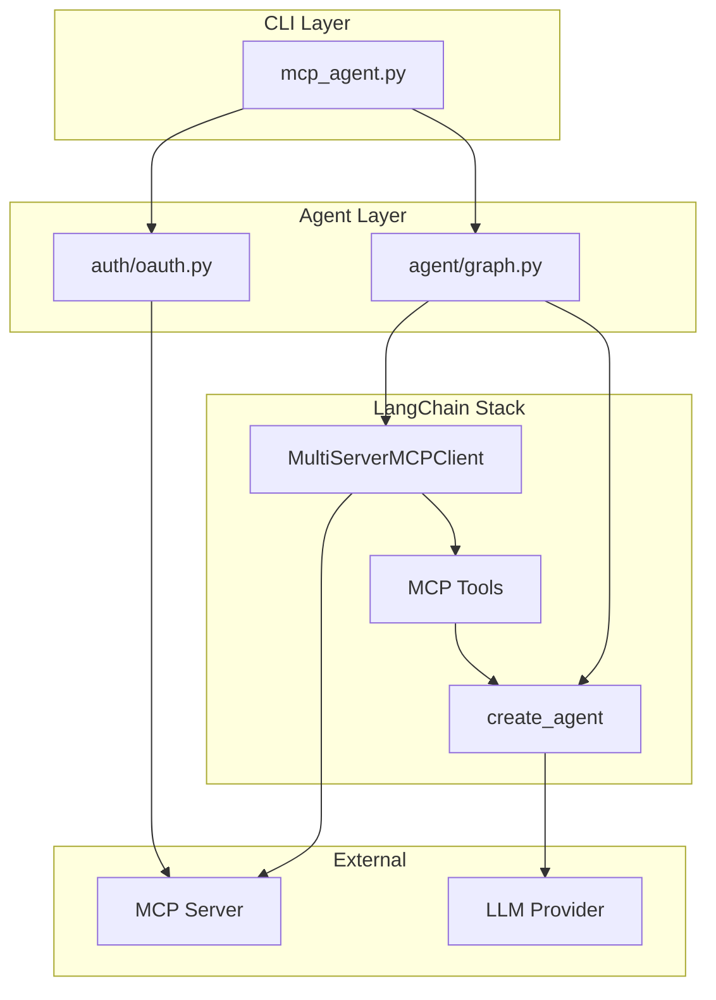

# LangGraph MCP Agent

[](https://www.python.org/downloads/)
[](https://opensource.org/licenses/MIT)
[](https://modelcontextprotocol.io/)

An interactive terminal agent that connects to [Model Context Protocol (MCP)](https://modelcontextprotocol.io/) servers using LangChain. Chat with AI assistants that can use tools exposed by any MCP server, with automatic OAuth authentication support.

## Features

- **Multi-Provider LLM Support** — Use Anthropic Claude or OpenAI GPT models
- **Automatic OAuth Authentication** — Seamlessly handles OAuth flows for protected MCP servers
- **Interactive Terminal Chat** — Rich terminal UI with markdown rendering and syntax highlighting
- **Tool Call Visualization** — See tool calls, arguments, and results in real-time
- **Built on Modern Stack** — Uses `langchain-mcp-adapters` with `create_agent` for a ReAct agent architecture

## Quick Start

```bash
# 1. Clone the repository
git clone https://github.com/cequenceai/aigateway-agents.git
cd aigateway-agents/langgraph

# 2. Install dependencies
pip install -r requirements.txt

# 3. Set your API key
export ANTHROPIC_API_KEY="your-api-key"

# 4. Run the agent
python mcp_agent.py --mcp-url http://localhost:8000/mcp
```

## Installation

### Prerequisites

- Python 3.11 or higher
- An API key for your chosen LLM provider (Anthropic or OpenAI)

### Setup

```bash
# Clone the repository
git clone https://github.com/cequenceai/aigateway-agents.git
cd aigateway-agents/langgraph

# (Recommended) Create a virtual environment
python -m venv venv
source venv/bin/activate  # On Windows: venv\Scripts\activate

# Install dependencies
pip install -r requirements.txt
```

## Configuration

### Environment Variables

| Variable | Required | Description |
|----------|----------|-------------|
| `ANTHROPIC_API_KEY` | Yes* | API key for Anthropic Claude models |
| `OPENAI_API_KEY` | Yes* | API key for OpenAI GPT models |
| `MCP_AGENT_PROVIDER` | No | Default LLM provider (`anthropic` or `openai`) |
| `MCP_AGENT_MODEL` | No | Default LLM model name |

*At least one API key is required, depending on which provider you use.

### Setting API Keys

```bash
# For Anthropic (default provider)
export ANTHROPIC_API_KEY="sk-ant-..."

# For OpenAI
export OPENAI_API_KEY="sk-..."
```

## Usage

### Basic Usage (Auto OAuth)

Connect to an MCP server. If OAuth is required, your browser will open automatically:

```bash
python mcp_agent.py --mcp-url https://your-mcp-server.com/mcp
```

### With Static Authorization Header

Use a pre-existing token or API key:

```bash
python mcp_agent.py --mcp-url https://your-mcp-server.com/mcp \
  --auth-header "Bearer your-token-here"
```

### Specifying LLM Provider and Model

```bash
# Use OpenAI GPT-4o
python mcp_agent.py --mcp-url http://localhost:8000/mcp \
  --provider openai \
  --model gpt-4o

# Use Anthropic Claude Sonnet
python mcp_agent.py --mcp-url http://localhost:8000/mcp \
  --provider anthropic \
  --model claude-sonnet-4-20250514
```

### Disable OAuth for Local Servers

For local development servers that don't require authentication:

```bash
python mcp_agent.py --mcp-url http://localhost:8000/mcp --no-oauth
```

## Architecture



### Project Structure

```
langgraph/
├── mcp_agent.py          # CLI entry point with Rich terminal UI
├── agent/
│   ├── __init__.py
│   └── graph.py          # Agent setup using MultiServerMCPClient
├── auth/
│   ├── __init__.py
│   └── oauth.py          # OAuth flow implementation
├── requirements.txt
└── README.md
```

## How It Works

1. **Connect to MCP Server** — The agent uses `MultiServerMCPClient` from `langchain-mcp-adapters` to establish a connection with the MCP server over HTTP.

2. **Load Tools** — Tools exposed by the MCP server are automatically discovered and converted to LangChain-compatible tools using `client.get_tools()`.

3. **Create ReAct Agent** — A ReAct (Reasoning + Acting) agent is created using LangChain's `create_agent()` function, which combines the LLM with the available tools.

4. **Interactive Chat Loop** — The CLI provides an interactive chat interface where you can send messages. The agent reasons about your request and uses tools as needed.

5. **Display Results** — Tool calls, their arguments, and results are displayed in real-time with rich formatting. The final response is rendered as markdown.

```python
# Core flow in agent/graph.py
client = MultiServerMCPClient({
    "mcp_server": {
        "transport": "http",
        "url": config.mcp_url,
    }
})

tools = await client.get_tools()
agent = create_agent(model_string, tools)
result = await agent.ainvoke({"messages": messages})
```

## Authentication

### Automatic OAuth Flow

When connecting to an MCP server that requires OAuth authentication:

1. **Callback Server Starts** — A local HTTP server starts on port `3030` to receive the OAuth callback
2. **Browser Opens** — Your default browser opens to the authorization page
3. **User Authenticates** — You log in and grant permissions
4. **Token Exchange** — The callback is captured and tokens are exchanged automatically
5. **Authenticated Requests** — All subsequent requests use the OAuth token

The OAuth flow uses the official MCP SDK's `OAuthClientProvider` with dynamic client registration.

### Supported Authentication Methods

| Method | Flag | Description |
|--------|------|-------------|
| Auto OAuth | (default) | Automatic browser-based OAuth flow |
| Static Header | `--auth-header` | Use a pre-existing Bearer token |
| No Auth | `--no-oauth` | Disable authentication (for local servers) |

## Chat Commands

While in the interactive chat:

| Command | Description |
|---------|-------------|
| `/quit`, `/exit`, `/q` | Exit the chat |
| `/clear` | Clear conversation history |
| `/help` | Show available commands |
| `Ctrl+C` | Exit immediately |

## CLI Arguments Reference

| Argument | Required | Default | Description |
|----------|----------|---------|-------------|
| `--mcp-url` | Yes | — | MCP server URL (e.g., `http://localhost:8000/mcp`) |
| `--auth-header` | No | — | Static authorization header (e.g., `Bearer token`) |
| `--no-oauth` | No | `false` | Disable automatic OAuth flow |
| `--provider` | No | `anthropic` | LLM provider (`anthropic` or `openai`) |
| `--model` | No | Provider default | LLM model name |

### Default Models

| Provider | Default Model |
|----------|---------------|
| Anthropic | `claude-sonnet-4-20250514` |
| OpenAI | `gpt-4o` |

## Example MCP Servers

To test the agent, you can create simple MCP servers using [FastMCP](https://gofastmcp.com/):

```bash
pip install fastmcp
```

### Math Server (HTTP Transport)

```python
# math_server.py
from fastmcp import FastMCP

mcp = FastMCP("Math")

@mcp.tool()
def add(a: int, b: int) -> int:
    """Add two numbers"""
    return a + b

@mcp.tool()
def multiply(a: int, b: int) -> int:
    """Multiply two numbers"""
    return a * b

if __name__ == "__main__":
    mcp.run(transport="streamable-http", port=8000)
```

Run the server:

```bash
python math_server.py
```

Then connect with the agent:

```bash
python mcp_agent.py --mcp-url http://localhost:8000/mcp --no-oauth
```

### Weather Server Example

```python
# weather_server.py
from fastmcp import FastMCP

mcp = FastMCP("Weather")

@mcp.tool()
async def get_weather(location: str) -> str:
    """Get weather for a location."""
    # In a real implementation, call a weather API
    return f"The weather in {location} is sunny and 72°F"

@mcp.tool()
async def get_forecast(location: str, days: int = 5) -> str:
    """Get weather forecast for a location."""
    return f"{days}-day forecast for {location}: Sunny with occasional clouds"

if __name__ == "__main__":
    mcp.run(transport="streamable-http", port=8000)
```

## Dependencies

| Package | Purpose |
|---------|---------|
| `langchain` | Core LangChain framework |
| `langgraph` | Graph-based agent orchestration |
| `langchain-mcp-adapters` | MCP protocol integration for LangChain |
| `langchain-anthropic` | Anthropic Claude model support |
| `langchain-openai` | OpenAI GPT model support |
| `mcp` | Model Context Protocol SDK |
| `rich` | Terminal formatting and UI |
| `httpx` | HTTP client |

## Contributing

Contributions are welcome! Here's how you can help:

1. **Fork** the repository
2. **Create** a feature branch (`git checkout -b feature/amazing-feature`)
3. **Commit** your changes (`git commit -m 'Add amazing feature'`)
4. **Push** to the branch (`git push origin feature/amazing-feature`)
5. **Open** a Pull Request

### Development Setup

```bash
# Clone the repository
git clone https://github.com/cequenceai/aigateway-agents.git
cd aigateway-agents/langgraph

# Create virtual environment
python -m venv venv
source venv/bin/activate

# Install dependencies
pip install -r requirements.txt

# Run tests (if available)
python -m pytest
```

## Troubleshooting

### Common Issues

**OAuth callback not received**
- Ensure port 3030 is not blocked by a firewall
- Check that no other application is using port 3030

**"No tools found on MCP server"**
- Verify the MCP server is running and accessible
- Check the server URL is correct (should end with `/mcp`)

**API key errors**
- Ensure the appropriate environment variable is set
- Verify your API key is valid and has sufficient credits

**Connection refused**
- Confirm the MCP server is running
- Check for network/firewall issues

## License

This project is licensed under the MIT License - see the [LICENSE](LICENSE) file for details.

## Acknowledgments

- [Model Context Protocol](https://modelcontextprotocol.io/) — The open protocol for AI tool integration
- [LangChain](https://langchain.com/) — Framework for building LLM applications
- [langchain-mcp-adapters](https://github.com/langchain-ai/langchain-mcp-adapters) — MCP integration for LangChain
- [FastMCP](https://gofastmcp.com/) — Quick MCP server development
